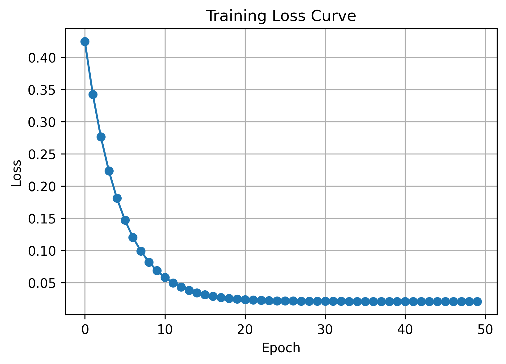

#Building Recurrent Neural Networks (RNN) from the Ground Up

 An all-inclusive implementation of Recurrent Neural Networks (RNN) constructed entirely with NumPy.  The fundamental concepts of RNNs, such as forward propagation, backpropagation through time (BPTT), and the full training pipeline, are illustrated in this project.


 ## Synopsis

 This project provides deep insights into the inner workings of RNNs by implementing a basic RNN architecture without the use of sophisticated deep learning frameworks.  There are three primary parts to it:


 1. Forward Propagation: Calculating hidden states over time sequences
 2. BPTT, or backpropagation through time  Calculating gradients to update weights
 3. The entire training pipeline  A complete RNN classifier that includes a training loop

## Characteristics

 Implementation using only NumPy (no TensorFlow, PyTorch, or Keras)
 Forward propagation with the SimpleRNN class
 SimpleRNN_BPTT class for gradient computation; ScratchSimpleRNNClassifier; Full RNN classifier with training; Validation against anticipated results
 Training visualization: Python script and Jupyter Notebook versions

 ## Project Organization

```
rnn-scratch/
├── rnn-scratch.ipynb          # Jupyter notebook with detailed explanations
├── rnn-scratch.py             # Python script version
├── requirements.txt           # Project dependencies
├── README.md                  # Project documentation
├── .gitignore                # Git ignore configuration
└── plots/
    └── training_loss_curve.png # Training visualization
```

## Getting Started

### Prerequisites

- Python 3.7+
- NumPy
- Matplotlib (for visualization)

### Installation

1. Clone the repository:
```bash
git clone https://github.com/oktakarisa/rnn-scratch.git
cd rnn-scratch
```

2. Install dependencies:
```bash
pip install -r requirements.txt
```

### Usage

**Option 1: Run the Python script**
```bash
python rnn-scratch.py
```

**Option 2: Open the Jupyter Notebook**
```bash
jupyter notebook rnn-scratch.ipynb
```

## Results

The implementation successfully trains an RNN classifier, with loss decreasing consistently across epochs:



### Example Output

```
Problem 1: SimpleRNN Forward Propagation Test
======================================================================
Final hidden state (h_T):
[[0.79494228 0.81839002 0.83939649 0.85584174]]

Matches expected: True

Problem 3: Training the RNN Classifier
======================================================================
Epoch 10, Loss: 0.068712
Epoch 20, Loss: 0.024700
Epoch 30, Loss: 0.021294
Epoch 40, Loss: 0.020934
Epoch 50, Loss: 0.020771
```

## Mathematical Foundation

### Forward Propagation

At each time step `t`, the RNN computes:

```
a_t = x_t · W_x + h_{t-1} · W_h + B
h_t = tanh(a_t)
```

Where:
- `x_t`: Input at time t
- `h_t`: Hidden state at time t
- `W_x`: Input weights
- `W_h`: Hidden state weights
- `B`: Bias term

### Backpropagation Through Time

Gradients are computed using:

```
∂L/∂W_x = Σ x_t^T · δ_t
∂L/∂W_h = Σ h_{t-1}^T · δ_t
∂L/∂B = Σ δ_t
```

Where `δ_t = ∂h_t/∂a_t · ∂L/∂h_t`

## Implementation Details

### Classes

**SimpleRNN**
- Basic RNN forward propagation
- Returns final hidden state and all intermediate states

**SimpleRNN_BPTT**
- Implements backpropagation through time
- Computes gradients for all weight matrices

**ScratchSimpleRNNClassifier**
- Complete RNN classifier
- Includes training loop with weight updates
- Tracks loss history

## Compliance with Assignments

 This implementation satisfies every prerequisite:
 The ScratchSimpleRNNClassifier class was implemented.
 Forward propagation using accurate formulas
 The advanced task of backpropagation via time
 Validated with a simple array test; full training pipeline
 Only NumPy is used (minimum libraries)

 ## Important Takeaways

 Knowing the fundamentals of RNN architecture
 Gradient computation using time sequences; weight initialization techniques
 The dynamics of recurrent network training
 Considerations for numerical stability

## License

This project is part of an educational assignment for understanding deep learning fundamentals.

## Author

**Karisa**

GitHub: [@oktakarisa](https://github.com/oktakarisa)
